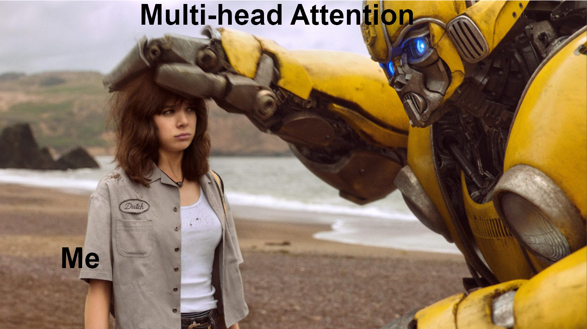
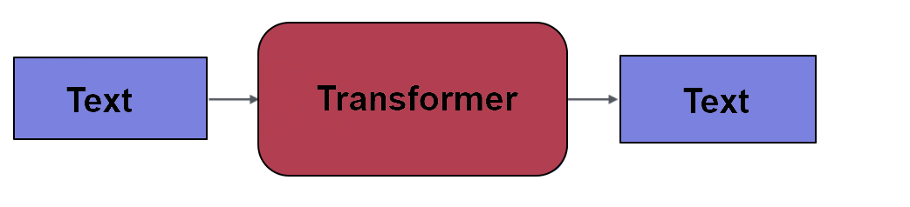
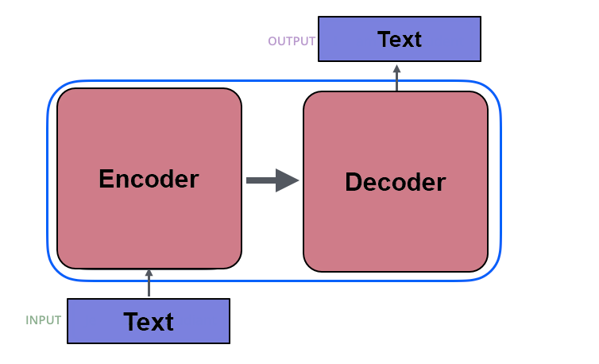
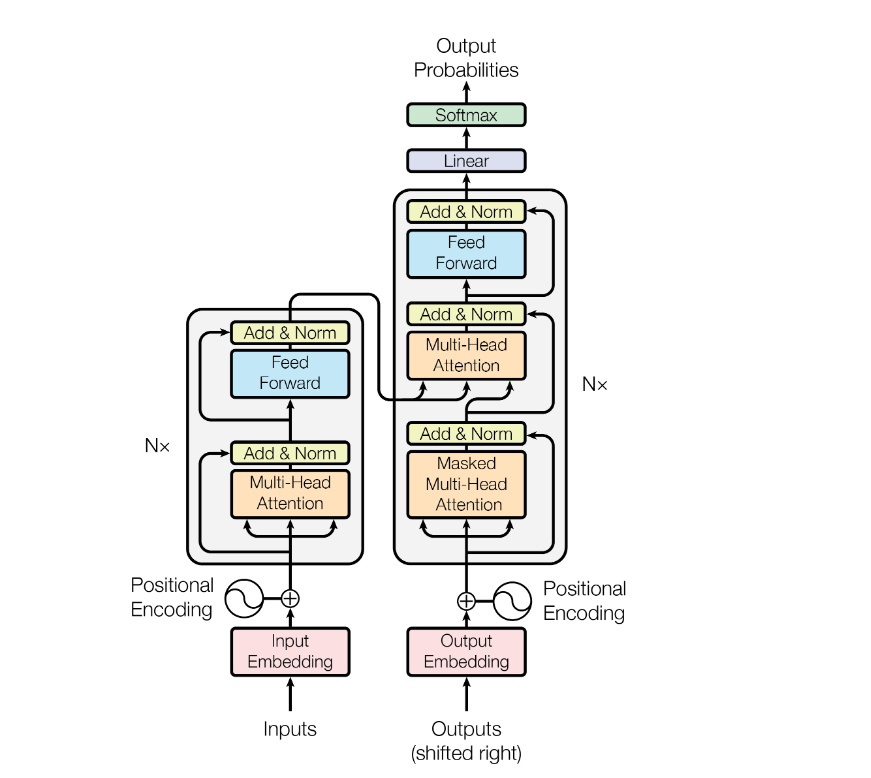
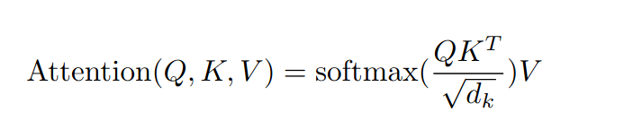

# Transformers... Summarize!!

## What are transformers?

#### In the language realm, the transformer is used in any text-to-text scenario, where we want to alter some incoming text to a different form of output text.
#### Examples include translation, summarization, or semantic labelling.

#### There are different types of transformers, but the one here is composed of an encoder and a decoder. The encoder requires the words to be converted to numbers. To maintain contextual meaning of words, word embedding is performed to create vectors.
#### Vector length represents the number of dimensions in which words can be related to each other.

#### The encoder essentially compresses the words into vector representations that still retain contextual information, and the job of the decoder is to reverse the process and expand back to the desired text.

#### The encoder and decoder contain several stacks, containing an attention and feed-foward network.

#### What is attention?

